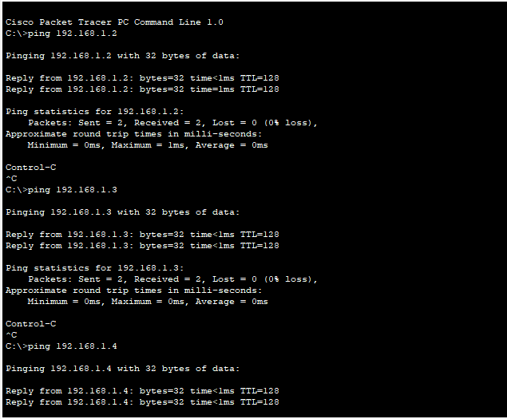
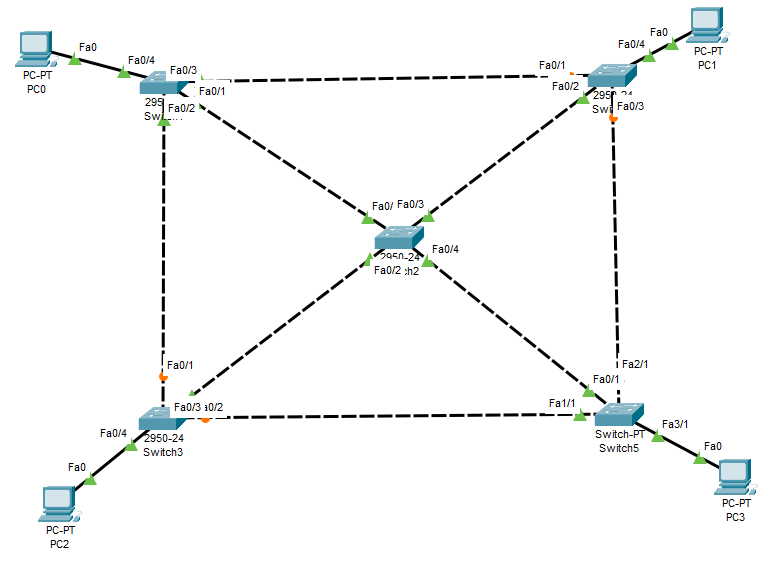
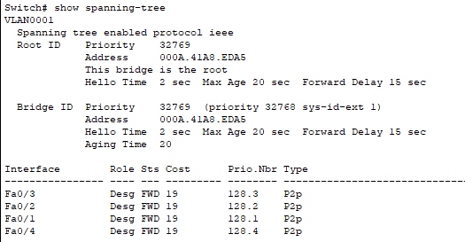

<h1>Ejercicio 10. Spanning Tree Protocol (STP).</h1>

1. ¿Cuántos bucles detectas en la red, independientemente del color de los
enlaces?

+  Puedo detectar 8 bucles.

2. Para la comprobación de las comunicaciones entre switches, se deben colocar equipos
conectados a los diferentes switches y configurar su direccionamiento IP para que todos
puedan comunicarse entre sí.

3. Se puede comprobar que hay varias uniones entre switches que están a medio activar (en un extremo están en verde, y en el otro están en naranja), pero hay un camino único que une todos los switches entre sí.

4.  Comprobación y recálculo de caminos del STP.

