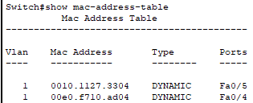
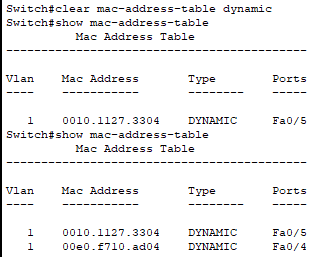
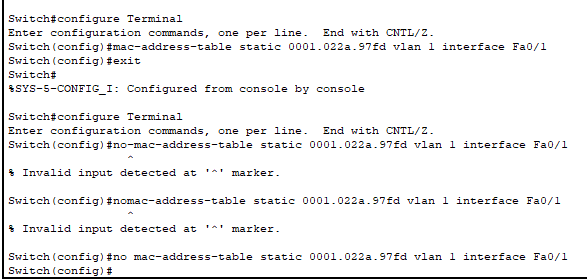

<h1>Ejercicio 12</h1>

1. Muestre la tabla del conmutador.



2. Elimine la tabla de MAC´s del conmutador.



3. Asigne una dirección MAC estática.



4. ¿Qué secuencia de comandos debemos utilizar para cambiar el puerto 24 del switch a puerto trunk de VLAN?

```
Debemos de seguir los sigientes comandos.
```
```
switch# configure terminal
```
```
switch(config)# interface fastethernet 0/24
```
```
switch(config-if)# switchport mode trunk
```
```
switch(config-if)# switchport trunk allowed vlan 1
```
```
switch(config-if)# end
switch# show interfaces fastethernet 0/24 switchport
```