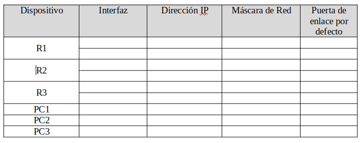

# Ejercicio 

Dado el esquema de red siguiente, montarlo en Packet Tracer, responder a las preguntas y subir la carpeta con todos los archivos al repositorio.


1. Rellena la siguiente tabla (debes quitar la imagen y poner la tabla en markdown, puedes usar este servicio https://www.tablesgenerator.com/):




2. Configura la dirección `IP` y la puerta de enlace para cada `PC`. 

+ PC1

```

```

+ PC2

```

```

+ PC3

```

```

3. Configura el nombre de cada Router y de cada switch según el esquema.

Para los routers:

+ R1

```

```

+ R2

```

```

+ R3

```

```
Para los switch:

+ S1

```

```

+ S2

```

```

+ S3

```

```
4. Configura las direcciones `IP` de cada router.

+ R1

```

```

+ R2

```

```

+ R3

```

```
5. Comprueba que has configurado las  direcciones `IP` bien. Para ello ejecuta el comando `show ip interface brief` en los tres Routers y cópialo en las siguientes cajas de código.

+ R1

```

```

+ R2

```

```

+ R3

```

```
6. Comprueba la tabla de encaminamiento en cada Router y muéstralo en las siguientes cajas de código:

+ R1

```

```

+ R2

```

```

+ R3

```

```

7. Prueba a hacer un ping desde el `R1` a `PC1`, desde `R2` a `PC2` y desde `R3` a `PC3`. Muestra el resultado en la siguiente caja de código:

+ R1-> PC1

```

```

+ R2-> PC2

```

```

+ R3-> PC3

```

```
8. Prueba a hacer ping desde el `PC1` al `PC2`, desde el `PC2` al `PC3`. ¿Porqué no funciona? Escribe una breve descripción de porque no funciona.

+ PC1-> PC2

```

```

+ PC2-> PC3

```

```
9. Copia los comandos que han permitido que funcione.

```

```
10. Muestra el resultado de las tablas de encaminamiento de los tres routers:

+ R1

```

```

+ R2

```

```

+ R3

```

```